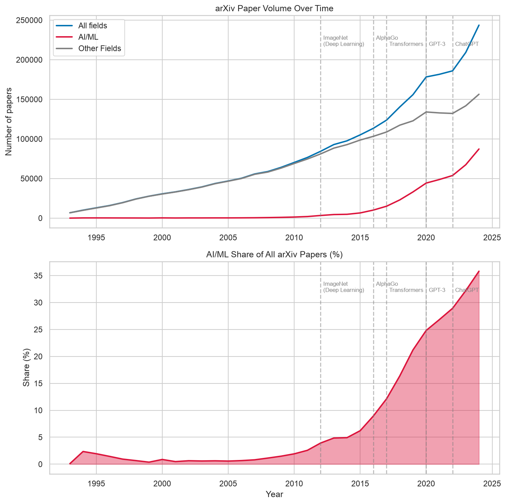
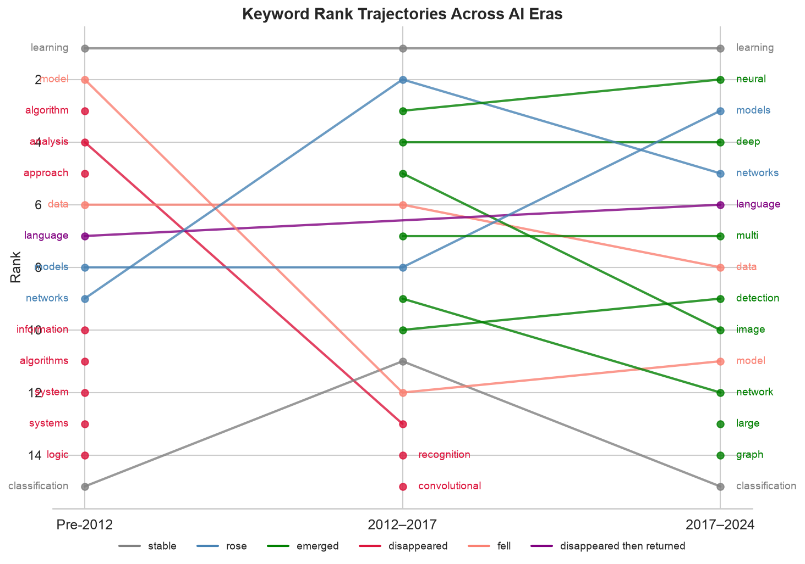
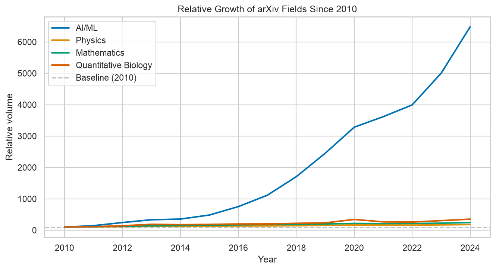
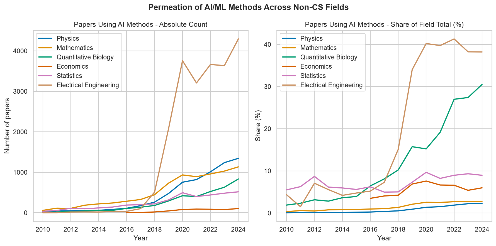

# How has AI research exploded? An analysis of arXiv papers

An exploratory data analysis of arXiv preprints, tracing the rise of Artificial Intelligence as a research field: when it accelerated, which subfields drove the growth, how the vocabulary shifted across eras, and how far AI has reached beyond its own borders.

_Dataset snapshot: 3,112,074 total submissions as of July 23, 2025 · 2,638,772 papers analyzed (1991–2024)_

---
## Motivation

arXiv is the primary preprint server for physics, mathematics, computer science, and quantitative biology. With the rise of artificial intelligence and its growing impact across science, **can we see the AI revolution in the publication record itself?**

---
## Questions explored

1. How has the volume of AI/ML papers grown over time?
2. Which AI subfields are growing fastest?
3. What keywords define each era of AI research?
4. How does AI growth compare to other fields - physics, mathematics, quantitative biology?

---
## Key findings

- **AI/ML submissions accelerated sharply after 2012**, with a curve that visually outpaces all other fields, reaching a nearly **65-fold increase** in volume by 2024, compared to 2–4x growth in physics, mathematics, and quantitative biology over the same period.

- **The share of AI-tagged papers grew from ~5% in 2014 to over 35% in 2024**, representing 15.5% of all arXiv submissions across the full 1991–2024 period, reflecting both the explosion of core AI research and the rapid permeation of machine learning methods into other disciplines.

- **The growth is not monolithic**: the fastest growing subfields since 2010 are Computation & Language/NLP (39%/year), Machine Learning (35%), and Computer Vision (35%) — all with doubling times under 2 years.

- **Classical AI vocabulary disappeared entirely**: terms like "algorithm", "logic", and "system", hallmarks of symbolic AI, are absent from recent titles, marking a clean paradigm shift toward data-driven methods.

- **"Language" traced the arc of the field itself**: present in classical AI, absent during the computer vision wave, then returning as the dominant term of the transformer era.

- **AI permeated well beyond computer science**: Electrical Engineering leads in adoption volume, while Quantitative Biology most surprisingly reaches nearly 30% of papers with AI/ML tags.

- **ChatGPT's release coincides with a recovery in submission rates across all fields**, suggesting that AI-assisted writing may have accelerated manuscript preparation beyond the AI community itself.

---
## Visualizations

-  Submission volume over time

*AI/ML paper volume against all arXiv submissions, with key milestones annotated. The 2020 slowdown reflects the COVID-19 pandemic; the post-2022 recovery coincides with the release of ChatGPT.*

- Keyword trajectories across eras

*Rank trajectories of key terms across three eras: Pre-2012 (Classical AI), 2012–2017 (Deep Learning), and 2017–2024 (Transformers & LLMs). Colors indicate trajectory type: stable, rising, emerging, or disappeared.*

- AI growth and cross-field penetration

*Indexed growth of AI vs other scientific fields since 2010.*

*Share of papers with AI/ML tags in non-CS fields, showing the rapid uptake of machine learning methods across disciplines.*

---
## Methods

- **Growth rates** estimated via log-linear regression per subfield (2010–2024), yielding annual growth rates and doubling times

- **Cross-field penetration** measured as the share of papers in each non-CS field carrying any AI/ML category tag, tracked annually since 2010

---
## Dataset

**arXiv Dataset** - Cornell University, via Kaggle  
Submissions from 1991 to 2024 · ~2.6 million papers · JSON lines format  
Fields used: title, categories, submission date  
Of these, 410152 (15.5%) carry at least one AI/ML category tag.  
[https://www.kaggle.com/datasets/Cornell-University/arxiv](https://www.kaggle.com/datasets/Cornell-University/arxiv)

---
## Tools & libraries

- Python 3.11
- Pandas · NumPy · Matplotlib · SciPy
- Collections · re (text processing)

---
## Next steps

- Analyze author networks to identify the most influential research groups
- Examine citation patterns to distinguish high-impact from high-volume subfields
- Track the geographic shift in AI output across eras
- Apply named entity recognition to track the rise and fall of specific architectures (LSTM, CNN, Transformer, GPT) as named entities in the literature

---

[LinkedIn](https://linkedin.com/in/debora-princepe) · [GitHub](https://github.com/deborapr)